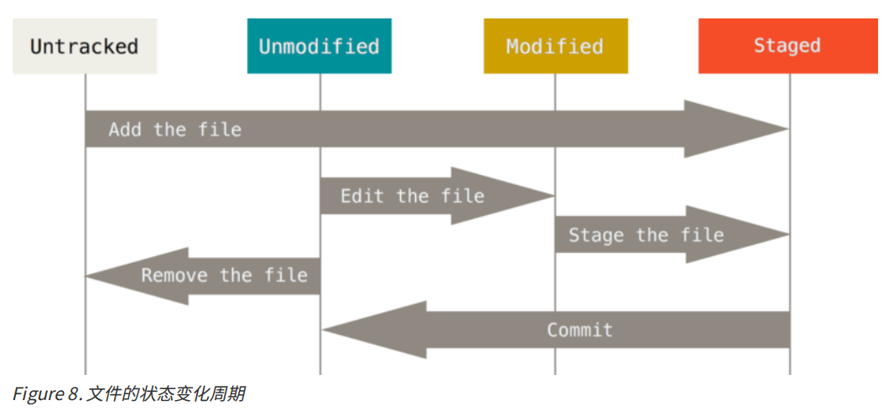
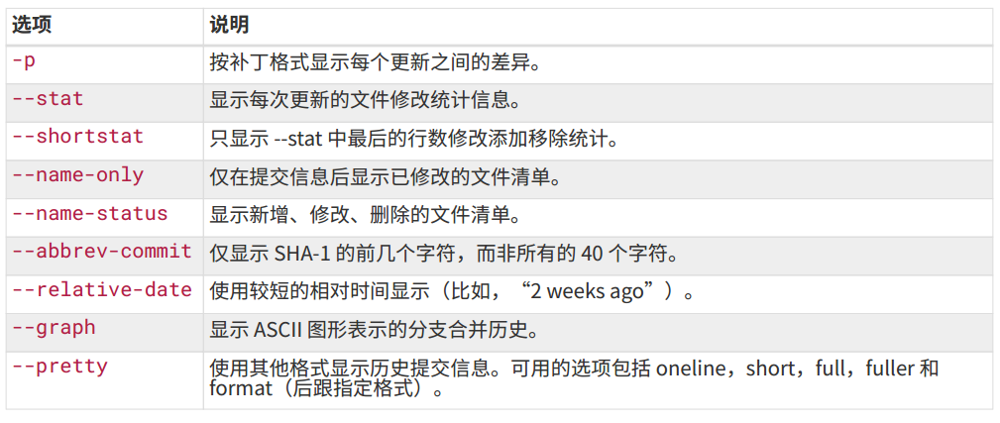
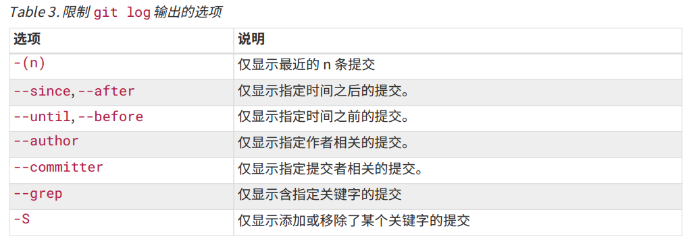
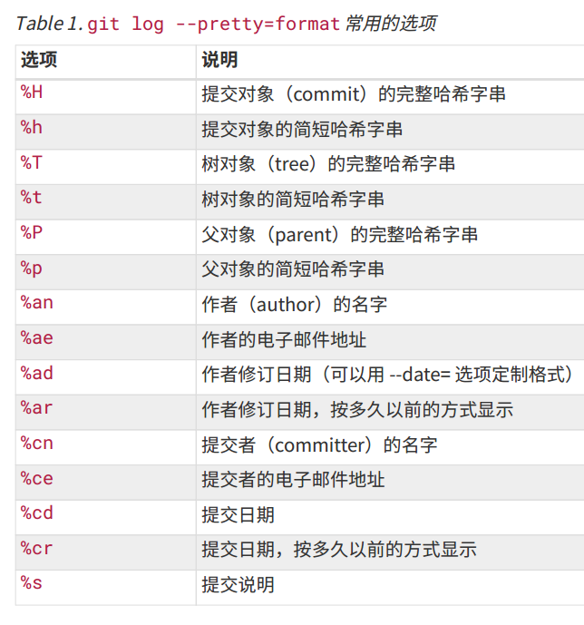
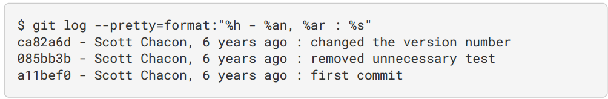
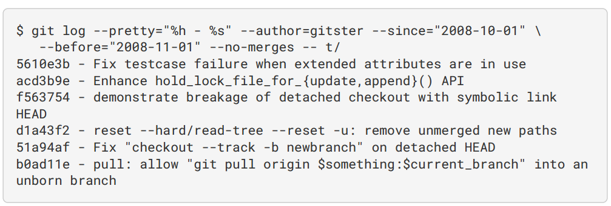
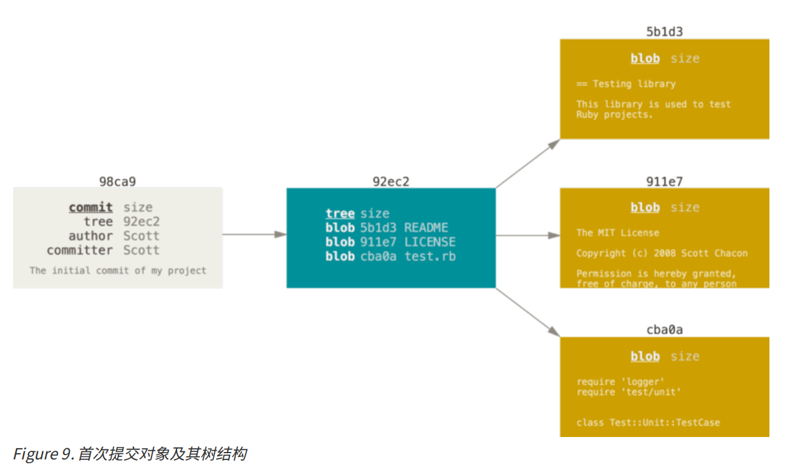
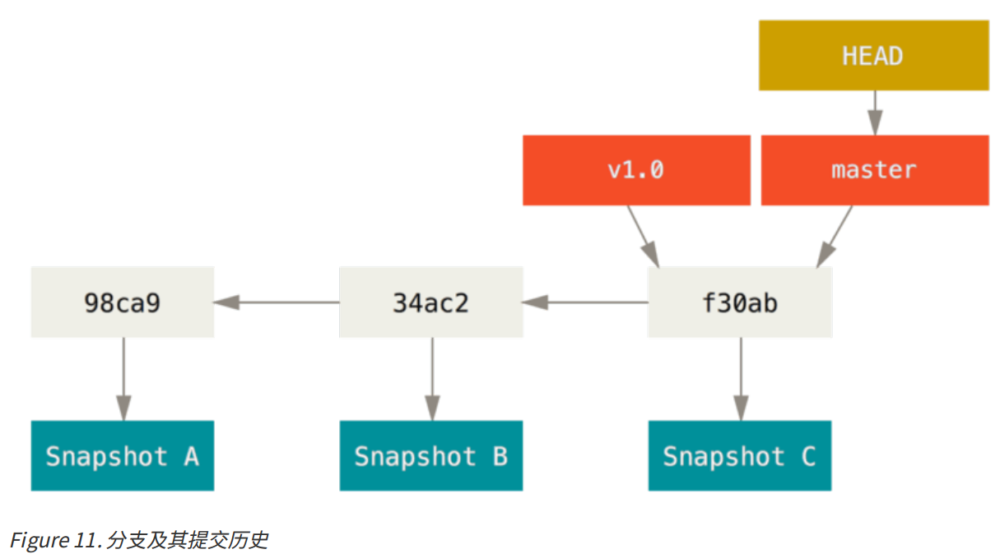
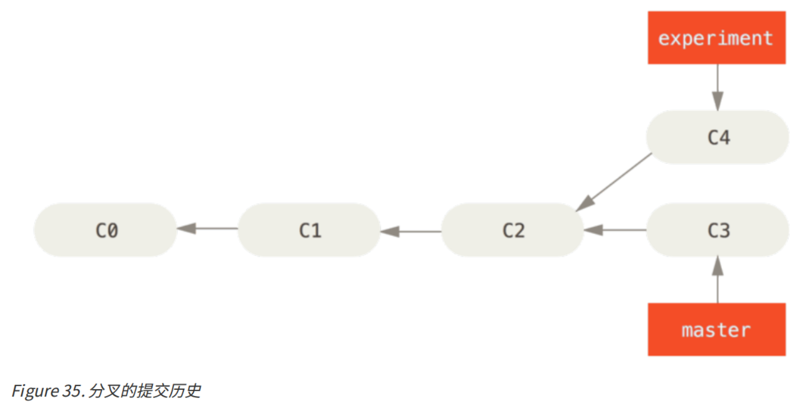
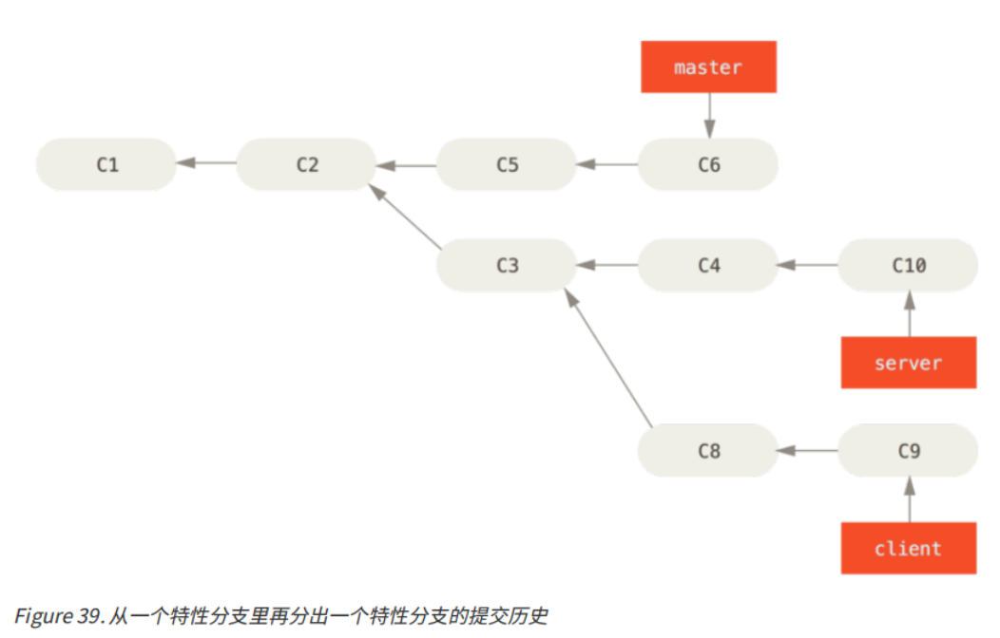

## 配置

* 使用 `git config --list` 列出所有Git可以找到的配置
* 使用 `git config <key>` 来检查配置
* `git status` 将列出当前目录下文件的状态(Untracked, Unmodified, Modefied, Staged)
* 请记住，你工作目录下的每一个文件都不外乎这两种状态：已跟踪或未跟踪。 **已跟踪(Tracked)的文件是指那些被纳入了版本控制的文件，在上一次快照中有它们的记录**，**在工作一段时间后，它们的状态可能处于未修改(Unmodified)，已修改(Modified)或已放入暂存区(Staged)**。 工作目录中除已跟踪文件以外的所有其它文件都属于未跟踪文件，它们既不存在于上次快照的记录中，也没有放入暂存区。 初次克隆某个仓库的时候，工作目录中的所有文件都属于已跟踪文件，并处于未修改状态。



* `git add` 命令使用文件或目录的路径作为参数；如果参数是目录的路径，该命令将递归地跟踪该目录下的所有文件。 这是个多功能命令：可以用它开始跟踪新文件，或者把已跟踪的文件放到暂存区，还能用于合并时把有冲突的文件标记为已解决状态等。 将这个命令理解为“添加内容到下一次提交中”而不是“将一个文件添加到项目中”要更加合适。
* 运行 `git status --short` 命令，你将得到一种更为紧凑的格式输出.
* 新添加的未跟踪文件前面有 `??` 标记，新添加到暂存区中的文件前面有 `A` 标记, 出现在右边的 `M` 表示该文件被修改了但是还没放入暂存区，出现在靠左边的 `M` 表示该文件被修改了并放入了暂存区。
* 我们可以创建一个名为 . `gitignore` 的文件，列出要忽略的文件模式。
    ``` shell
    # no .a files
    *.a
    # but do track lib.a, even though you're ignoring .a files above
    !lib.a
    # only ignore the TODO file in the current directory, not subdir/TODO
    /TODO
    # ignore all files in the build/ directory
    build/
    # ignore doc/notes.txt, but not doc/server/arch.txt
    doc/*.txt
    # ignore all .pdf files in the doc/ directory
    doc/**/*.pdf
    ```

* [Github提供了.gitignore的范本](https://github.com/github/gitignore)
* `git diff` 查看修改了的文件的修改的部分. `git diff --staged` 查看差异. `git difftool` 用文本编辑软件查看差异.
* `git commit` 启动默认的文本编辑器以便输入本次提交的说明. 最终关闭编辑器后git会丢掉注释行, 将你添加的信息提交. 使用 `git commit -a` 跳过 `git add` 步骤.
* `git rm` 移除文件, 可以添加glob模式的后缀
* 移动文件, `git mv file_from file_to` 
* 查看提交历史, `git log` 

    
    

    1. `-<n>` 显示最近n次的
    2. `git log --pretty=format` ,  这个选项可以指定使用不同于默认格式的方式展示提交历史。

        
        

    3. 限制 `git log` 输出的选项

    

* 补充提交 `git commit --amend` 
* 取消暂存的文件 `git reset HEAD<file>...` 
* 撤销对文件的修改 `git checkout --[file]` 

### 远程仓库交互命令
+ 列出远程服务器的简写`git remote`, 默认为`origin`. 使用`git remote -v`会显示需要读写远程仓库使用的Git保存的简写及对应的URL
+ 添加远程仓库`git remote add <shortname> <url>`, 此后可用`<shortname>`代指该仓库
+ 抓取`git fetch [remote-name]`. 必须注意 `git fetch` 命令会将数据拉取到你的本地仓库——它并不会自动合并或修改你当前的工作。 当准备好时你必须手动将其合并入你的工作。
+ 如果你有一个分支设置为跟踪一个远程分支（阅读下一节与 Git 分支 了解更多信息），可以使用`git pull` 命令来自动的抓取然后合并远程分支到当前分支。 这对你来说可能是一个更简单或更舒服的工作流程；默认情况下，`git clone` 命令会自动设置本地 `master` 分支跟踪克隆的远程仓库的 `master` 分支（或不管是什么名字的默认分支）。 运行 `git pull` 通常会从最初克隆的服务器上抓取数据并自动尝试合并到当前所在的分支。
+ 推送到远程仓库 `git push [remote-name] [branchname]` 只有当你有所克隆服务器的写入权限，并且之前没有人推送过时，这条命令才能生效。 当你和其他人在同一时间克隆，他们先推送到上游然后你再推送到上游，你的推送就会毫无疑问地被拒绝。 你必须先将他们的工作拉取下来并将其合并进你的工作后才能推送。
+ 查看某个远程仓库的详细信息`git remote show [remote-name]`
+ 远程仓库的重命名`git remote rename [original-name] [changed-name]`
+ 远程仓库的移除`git remote rm [name]`
### tag
+ 列出已有的标签 `git tag`
+ 你也可以使用特定的模式查找标签。如果只对 1.8.5系列感兴趣，可以运行：`git tag -l 'v1.8.5*'`
+ 标签分为两类：轻量标签（lightweight）与附注标签（annotated）。一个轻量标签很像一个不会改变的分支——它只是一个特定提交的引用。附注标签是存储在 Git 数据库中的一个完整对象。 它们是可以被校验的。通常建议创建附注标签，这样你可以拥有以上所有信息；但是如果你只是想用一个临时的标签，或者因为某些原因不想要47保存那些信息，轻量标签也是可用的
+ 通过使用 `git show` 命令可以看到标签信息与对应的提交信息
+ 创建**附注标签**最简单的方式是当你在运行 `tag` 命令时指定 `-a` 选项
+ ** 轻量标签**本质上是将提交校验和存储到一个文件中——没有保存任何其他信息。通过`git tag v1.4-lw`
+ 后期打标签 `git tag -a v1.2 9fceb02`
+ 共享标签 `git push origin v1.5` 或全部推送 `git push origin --tags`
+ 要删除掉你本地仓库上的标签，可以使用命令 `git tag -d <tagname>`, 也可以使用下面的命令删除掉一个轻量级标签：`git tag -d v1.4-lw`
+ 你必须使用 `git push <remote>:refs/tags/<tagname>` 来更新你的远程仓库：如`git push origin :refs/tags/v1.4-lw`
+ 如果你想查看某个标签所指向的文件版本，可以使用 `git checkout` 命令，虽然说这会使你的仓库处于"分离头指针(detacthed HEAD)"状态——这个状态有些不好的副作用：你的新提交将不属于任何分支，并且将无法访问，除非确切的提交哈希。
+ 因此，如果你需要进行更改——比如说你正在修复旧版本的错误——这通常需要创建一个新分支：`git checkout -b version2 v2.0.0`

### 别名
+ 如果不想每次都输入完整的 `Git` 命令，可以通过 `gitconfig` 文件来轻松地为每一个命令设置一个别名。
    ```shell
    $ git config --global alias.co checkout
    $ git config --global alias.br branch
    $ git config --global alias.ci commit
    $ git config --global alias.st status
    ```


### Git 分支
+ 当使用 git commit 进行提交操作时，Git 会先计算每一个子目录（本例中只有项目根目录）的校验和，然后在Git 仓库中这些校验和保存为树对象。 随后，Git 便会创建一个提交对象，它除了包含上面提到的那些信息外，还包含指向这个树对象（项目根目录）的指针。如此一来，Git 就可以在需要的时候重现此次保存的快照。
+ 确认提交后, Git 仓库中有五个对象：三个 blob 对象（保存着文件快照）、一个树对象（记录着目录结构和 blob 对象索引）以及一个提交对象（包含着指向前述树对象的指针和所有提交信息）。


+ 分支创建 `git branch <branch_name>`
+ Git 通过一个名为 `HEAD` 的特殊指针来知道当前在哪一个分支上
+ 你可以简单地使用 `git log` 命令查看各个分支当前所指的对象。 提供这一功能的参数是 `--decorate`。
+ 要切换到一个已存在的分支，你需要使用 `git checkout <分支名>` 命令. 这条命令做了两件事。 一是使`HEAD` 指回 给定的 分支，二是将工作目录恢复该分支所指向的快照内容。也就是说，你现在做修改的话，项目将始于一个较旧的版本。本质上来讲，这就是忽略 另外一条 分支所做的修改，以便于向另一个方向进行开发。
+ 运行 `git log --oneline --decorate --graph --all` ，它会输出你的提交历史、各个分支的指向以及项目的分支分叉情况。
+ 想要新建一个分支并同时切换到那个分支上，你可以运行一个带有 `-b` 参数的 `git checkout` 命令
+ 你可以运行你的测试，确保你的修改是正确的，然后将其合并回你的 master 分支来部署到线上。 你可以使用 `git merge` 命令来达到上述目的
+ 你可以使用带 -d 选项的`git branch`命令来删除分支`git branch -d hotfix`
+ 如果你想使用图形化工具来解决冲突，你可以运行 `git mergetool`
+ `git branch` 命令不只是可以创建与删除分支。 如果不加任何参数运行它，会得到当前所有分支的一个列表, 如果需要查看每一个分支的最后一次提交，可以运行 `git branch -v` 命令
+ 如果要查看哪些分支已经合并到当前分支，可以运行 `git branch --merged`
    ```shell
    git branch --merged
    iss53
    master
    ```
    因为之前已经合并了 iss53 分支，所以现在看到它在列表中。 在这个列表中分支名字前没有 * 号的分支通常可以使用 git branch -d 删除掉；你已经将它们的工作整合到了另一个分支，所以并不会失去任何东西。


### 远程分支
+ 你可以通过 `git ls-remote (remote)` 来显式地获得远程引用的完整列表，或者通过 `git remote show (remote)` 获得远程分支的更多信息。 然而，一个更常见的做法是利用远程跟踪分支。
+ 远程跟踪分支是远程分支状态的引用。 它们是你不能移动的本地引用，当你做任何网络通信操作时，它们会自动移动。 远程跟踪分支像是你上次连接到远程仓库时，那些分支所处状态的书签。
+ 它们以 (remote)/(branch) 形式命名，即为(<仓库名>/<分支名>)
+ "origin"只是当你运行 git clone 时默认的远程仓库名字。 无特殊含义
+ 如果要同步你的工作，运行 `git fetch origin` 命令。 这个命令查找 “origin” 是哪一个服务器（在本例中，它是 `git.ourcompany.com`），从中抓取本地没有的数据，并且更新本地数据库，移动 `origin/master`指针指向新的、更新后的位置。
+ 你可以运行 `git remote add` 命令添加一个新的远程仓库引用到当前的项目
+ 可以运行 `git fetch <name>` 来抓取远程仓库 `<name>` 有而本地没有的数据
+ 如果希望和别人一起在名为 `serverfix` 的分支上工作，你可以像推送第一个分支那样推送它。 运行 `git push (remote) (branch)`. 推送本地的`serverfix` 分支，将其作为远程仓库的 `serverfix` 分支
+ 下一次其他协作者从服务器上抓取数据时，运行`git fetch origin`， 他们会在本地生成一个远程分支 `origin/serverfix`，指向服务器的 serverfix 分支的引用
+ 要特别注意的一点是当抓取到新的远程跟踪分支时，本地不会自动生成一份可编辑的副本（拷贝）。 换一句话说，这种情况下，不会有一个新的 `serverfix` 分支——只有一个不可以修改的 `origin/serverfix` 指针。
+ 可以运行 `git merge origin/serverfix` 将这些工作合并到当前所在的分支。 如果想要在自己的 `serverfix` 分支上工作，可以将其建立在远程跟踪分支之上：`git checkout -b serverfix origin/serverfix`
+ 当克隆一个仓库时，它通常会自动地创建一个跟踪 `origin/master` 的 master 分支。 拉取其它分支时则不会自动创建本地的跟踪分支, 但可以通过`git checkout --track origin/serverfix` 或 `git checkout -b sf(别名) origin/serverfix`或`git branch -u origin/serverfix`
+ 如果想要查看设置的所有跟踪分支，可以使用 `git branch` 的 `-vv` 选项。 这会将所有的本地分支列出来并且包含更多的信息，如每一个分支正在跟踪哪个远程分支与本地分支是否是领先、落后或是都有。
+ `git pull` 在大多数情况下它的含义是一个 `git fetch` 紧接着一个`git merge` 命令。 
+ 可以运行带有 `--delete` 选项的 `git push` 命令来删除一个远程分支。 即, 如果想要从服务器上删除 serverfix 分支，运行下面的命令`git push origin --delete serverfix`

### 变基合并--rebase
+ 可以使用 rebase 命令将提交到某一分支上的所有修改都移至另一分支上
+ 
+ 运行如下命令后
    ```shell
    $ git checkout experiment
    $ git rebase master
    First, rewinding head to replay your work on top of it...
    Applying: added staged command
    ```
    它的原理是首先找到这两个分支（即当前分支 experiment、变基操作的目标基底分支 master）的最近共同祖先 C2，然后对比当前分支相对于该祖先的历次提交，提取相应的修改并存为临时文件，然后将当前分支指向目标基底 C3, 最后以此将之前另存为临时文件的修改依序应用。
+ 之后可以回到 master 分支，进行一次快进合并。`git checkout master`; `git merge experiment`
+ 无论是通过变基，还是通过三方合并，整合的最终结果所指向的快照始终是一样的，只不过提交历史不同罢了。 变基是将一系列提交按照原有次序依次应用到另一分支上，而合并是把最终结果合在一起。
#### 处理" 从一个特性分支里再分出一个特性分支的提交历史"的情况

+ 假设你希望将 client 中的修改合并到主分支并发布，但暂时并不想合并 server 中的修改，因为它们还需要经过更全面的测试。 这时，_你就可以使用 git rebase 命令的 --onto 选项，选中在 client 分支里但不在server 分支里的修改（即 C8 和 C9），将它们在 master 分支上重放_：`git rebase --onto master server client`
+ 接下来你决定将 server 分支中的修改也整合进来。 **使用 git rebase [basebranch] [topicbranch] 命令可以直接将特性分支（即本例中的 server）变基到目标分支（即 master）上。这样做能省去你先切换到server 分支，再对其执行变基命令的多个步骤**。 `git rebase master server`
#### 变基的风险
+ 如果你已经将提交推送至某个仓库，而其他人也已经从该仓库拉取提交并进行了后续工作，此时，如果你用 `git rebase` 命令重新整理了提交并再次推送，你的同伴因此将不得不再次将他们手头的工作与你的提交进行整合，如果接下来你还要拉取并整合他们修改过的提交，事情就会变得一团糟。
+ 详见Pro Git——变基小结（要是写笔记的话基本就得全粘过来了）
+ 如果你习惯使用 git pull ，同时又希望默认使用选项 --rebase，你可以执行这条语句 `git config--global pull.rebase true` 来更改 pull.rebase 的默认配置。
+ 如果你或你的同事在某些情形下决意要这么做，请一定要通知每个人执行 `git pull --rebase` 命令，这样尽管不能避免伤痛，但能有所缓解。
+ 总的原则是，只对尚未推送或分享给别人的本地修改执行变基操作清理历史，从不对已推送至别处的提交执行变基操作，这样，你才能享受到两种方式带来的便利。